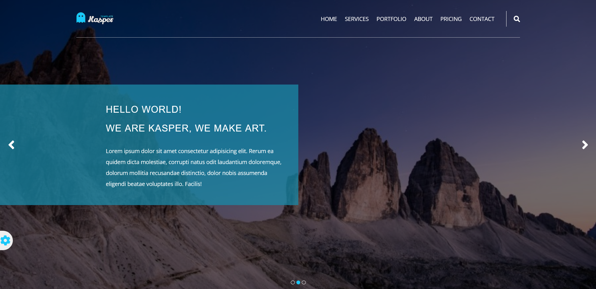

## Kasper template

- This template project was one of my first JavaScript projects built with pure css and vanilla javascript,
  the main concepts of this project are Local Storage and Respnsive deign.

### Screenshot

### Links

- Solution URL: [https://karimaoulallay.github.io/Kasper-template/]

### Built with

- Semantic HTML5 markup
- CSS custom properties
- Flexbox
- CSS Grid
- Mobile-first workflow
- Local storage

## Author

- Frontend Mentor - (https://www.frontendmentor.io/profile/karimode)
- Twitter - (https://twitter.com/karim_aoulallay)
